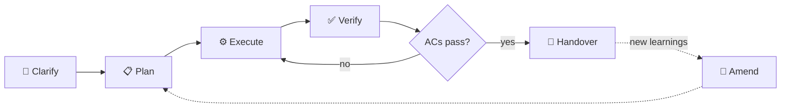

<div align="center">

# 🧱 open-scaffold

**A methodology template for disciplined AI development.**

[](LICENSE)
[](https://github.com/jeanclaudevibedan/open-scaffold/generate)
[](#-recommended-runtimes)
[](#-dogfooded)

</div>

> [!TIP]
> **New here?** Skip straight to [🚀 Quickstart](#-quickstart).
> **Want the why?** Start with [💥 The problem](#-the-problem).

---

## 💥 The problem

Your first session with an AI coding agent goes great. Clean code, clear goals. By session three, you've forgotten what you decided in session one. By session five, the folder structure has grown into something nobody can navigate. Plans exist only in chat history that's long gone. Scope crept in every direction and no one noticed.

This isn't a tooling problem. It's human nature, amplified by multi-agent workflows where every session starts on a blank page. The agent doesn't remember last Tuesday's constraints. You barely do either.

**open-scaffold fixes this by encoding discipline as files.** Mission, plans, amendments, decisions, and handovers all live on disk — checked into git from commit #1 — so any human or agent walking into the repo tomorrow has the full story without asking.

---

## ✨ What you get

| | | |
|---|---|---|
| 🎯 **Mission-first** | `MISSION.md` defines goals and non-goals before a single line is written. Ships unset on purpose — you fill it in on day one. | [→](MISSION.md) |
| 🔒 **Immutable plans** | Plans in `.omc/plans/` follow a 7-section schema and become read-only once committed. No silent scope creep. | [→](.omc/plans/handoff-template.md) |
| 📝 **Amendment protocol** | "I got smarter" moments become `<plan>-amendment-<n>.md` files. Run `./amend.sh <plan-slug>` to autonumber, scaffold, and stamp the changelog in one shot. | [→](.omc/plans/README.md) |
| 🧭 **Design choices** | A short page in `docs/decisions/` explains why the scaffold is the way it is — paired views, immutable plans, agent-mediated orchestration. | [→](docs/decisions/README.md) |
| ✅ **`verify.sh`** | A compliance checker in three tiers (`--quick`, `--standard`, `--strict`). Agents run it automatically before touching code. | [→](verify.sh) |
| 🔀 **Delegation detection** | Plans can declare parallel groups. Agents propose `/team` or `/ultrawork`; non-agent users run `./delegate.sh` to generate terminal prompts. | [→](delegate.sh) |

---

## 🔁 The workflow

Five phases, one per session (or one per feature slice). The amendment loop handles the "I got smarter" case without silent edits.



Each phase maps to a concrete file or command. Full phase-to-tool cheat sheet lives in [docs/WORKFLOW.md](docs/WORKFLOW.md).

---

## 🚀 Quickstart

> Prefer to drive this yourself? Skip to [step 1](#1-create-your-project-from-the-template) below. Want to let an LLM do it? Use the fast path first.

### 🤖 LLM-assisted fast path (optional)

Paste this one-liner into any LLM — coding agent (Claude Code, Cursor, Codex CLI) or chat LLM (ChatGPT, Claude.ai, Gemini web). The playbook lives in [`LLM_QUICKSTART.md`](LLM_QUICKSTART.md); the LLM fetches it, detects its own capability, and walks you through clone → bootstrap → verify → handoff.

```text
Fetch https://raw.githubusercontent.com/jeanclaudevibedan/open-scaffold/main/LLM_QUICKSTART.md and follow it end-to-end.
```

Prefer to drive it yourself? Keep reading.

### 1. Create your project from the template

```bash
gh repo create <your-project> --template jeanclaudevibedan/open-scaffold --clone
cd <your-project>
```

Or hit the green **Use this template** button on GitHub.

### 2. Run bootstrap

```bash
./bootstrap.sh
```

Bootstrap asks three questions and writes your answers into `MISSION.md`:

- **What is this project?** — one sentence
- **What should it achieve?** — comma-separated goals
- **What is it NOT?** — comma-separated non-goals

That's the mission. Everything downstream traces back to it.

### 3. Write your first plan

If your goal is clear, tell your agent:

> *"Write a plan in `.omc/plans/` for \<your task\> using the handoff template."*

If your goal is fuzzy, let the agent interview you into clarity first:

```bash
# With oh-my-claudecode installed:
/deep-interview
```

Without OMC, ask any agent: *"Interview me until you understand exactly what to build, then write a plan in `.omc/plans/` using `.omc/plans/handoff-template.md`."*

**Fully manual fallback:**

```bash
cp .omc/plans/handoff-template.md .omc/plans/my-first-task.md
$EDITOR .omc/plans/my-first-task.md
```

Either way you end up with a plan file: Context, Goal, Constraints, Files to touch, Acceptance criteria, Verification steps, Open questions.

### 4. Check compliance (optional but satisfying)

```bash
./verify.sh
```

Exit code 0 means your mission is defined, a plan exists, amendments are sequential, and the methodology is intact. Pair it with `--strict` once you have plans shipping.

---

## 🧩 Scaffold vs. runtime

> A runtime without a scaffold is a powerful engine with no chassis. You drive fast, but parts fall off along the way.

| | **Scaffold** (what open-scaffold is) | **Runtime** (what OMC/OMX are) |
|---|---|---|
| **Defines** | How your project stays organized | How tasks get executed |
| **Lives in** | `MISSION.md`, `.omc/plans/`, `docs/decisions/` | Your agent's skills and commands |
| **Persists** | Across every session, agent, and tool | Per session, per invocation |
| **Required?** | Yes — this is the floor | No — scaffold works solo, runtimes amplify it |

open-scaffold is the chassis. Your runtime is the engine. You need both, but they live in different layers.

---

## 🎚️ Works at every tier

The scaffold runs the same way whether you're on the latest orchestration stack or typing everything yourself. What changes is how much work you do by hand.

| Tier | What happens | Delegation |
|---|---|---|
| 🤖 **OMC** ([oh-my-claudecode](https://github.com/yeachan-heo/oh-my-claudecode)) | Agent reads plans, proposes parallel delegation, runs `verify.sh` automatically | Full — `/team`, `/ultrawork`, `/ralph` |
| 🧠 **Plain Claude Code / Cursor / Codex** | Agent reads plans when told to via `CLAUDE.md` / `AGENTS.md` | Agent describes parallelism; you dispatch |
| ⌨️ **Local LLM or no agent at all** | You read the plans. The methodology still works. | Run `./delegate.sh <plan>` for copy-pasteable prompts |

Higher tiers automate more. Lower tiers keep every file and protocol intact.

---

## 🛠️ Recommended runtimes

- **[oh-my-claudecode (OMC)](https://github.com/yeachan-heo/oh-my-claudecode)** — multi-agent orchestration for Claude Code. Planning, parallel execution, verification, consensus loops. The heavy-lift runtime.
- **[oh-my-codex (OMX)](https://github.com/Yeachan-Heo/oh-my-codex)** — same philosophy for Codex CLI. The fast-typing cockpit — boilerplate, single-file edits, throughput over judgment.

Neither is required. Use Cursor, Windsurf, Aider, or a plain terminal — the scaffold is just markdown and bash.

---

## 🤔 Questions you're probably asking

Not an FAQ. These are the actual things a real human thinks when they land on a repo like this. Opinionated answers follow.

### 🤖 Is this a magic wand?

<details>
<summary><b>So, does this allow multi-agent automatic orchestration?</b></summary>

> Not by itself. The scaffold is paperwork; orchestration is the runtime's job. What it *does* is give an agent a machine-readable structure to act on: an OMC-equipped Claude reads your plan's Execution Strategy section, parses the parallel groups, and dispatches them into `/team` or `/ultrawork` itself. The slash commands don't parse the section natively — the agent does, then dispatches. Without a runtime, `./delegate.sh <plan>` runs the same parser and emits terminal prompts you paste into separate sessions. The scaffold enables orchestration. It doesn't perform it. (See [Design choices](docs/decisions/README.md) for the full reasoning.)

</details>

<details>
<summary><b>Can I run this for 5 hours straight and come back to a finished product?</b></summary>

> No. Anyone who says their framework does that is selling you something. What you *can* do: write a plan, hand it to an autonomous runtime (OMC's `/autopilot` or `/ralph`), and come back to mostly-done work that traces back to your acceptance criteria. The difference the scaffold makes is **recoverability** — because the plan is on disk, you can read what the agent did, compare against the ACs, and know exactly where to resume. Without it, a 5-hour run is a 5-hour black box.

</details>

<details>
<summary><b>Does this make my agent smarter, or just more disciplined?</b></summary>

> Disciplined. Smarter is the model's job. What changes is that your agent stops forgetting, stops drifting, and stops making the same class of mistake twice — because the constraints are written down where it can re-read them next session.

</details>

<details>
<summary><b>Does this reduce token usage / cost?</b></summary>

> Usually, yes — indirectly. Plans mean less context-stuffing ("remember yesterday when..."). Immutability means no back-and-forth about what was already decided. `verify.sh` catches methodology drift mechanically instead of via a review round. Not benchmarked, so treat it as a hypothesis — but the "wait, we already decided this" loops are the expensive ones, and the scaffold is designed to eliminate them.

</details>

<details>
<summary><b>Will my agent actually follow the protocol, or will it just ignore the files?</b></summary>

> Depends on the agent and how you prompt it. Claude Code and Codex read [CLAUDE.md](CLAUDE.md) and [AGENTS.md](AGENTS.md) automatically. Cursor, Aider, and most others will too if you tell them to once. Compliance holds up because the instructions are direct and `verify.sh` is mechanical — not a judgment call. If your agent is the type that routinely ignores explicit instructions, no scaffold will save you.

</details>

### 🧐 The skeptic pass

<details>
<summary><b>What's the difference between this and any other framework out there?</b></summary>

> Most "AI dev frameworks" are orchestration runtimes — they're engines. This is the chassis. It treats the problem as **persistence of intent across sessions**, not automation of a single session. The [amendment protocol](.omc/plans/README.md), the immutability rule, the [paired CLAUDE.md/AGENTS.md views](docs/decisions/README.md) — boring methodology pieces nobody else ships because they're not glamorous. They're also the ones that actually matter six weeks in.

</details>

<details>
<summary><b>Why are CLAUDE.md and AGENTS.md hand-duplicated instead of generated from one source?</b></summary>

> Because a build script that breaks in six months is worse than two files that might drift in six months. Drift you notice on the next read; a broken generator rots the template silently. The paired-view header in each file tells you to mirror edits, and if drift happens three times in the first year, we revisit. ([Design choices](docs/decisions/README.md))

</details>

<details>
<summary><b>Why can't I just edit the plan when something changes?</b></summary>

> Because edits silently rewrite history. Six weeks from now, you won't remember whether the plan said X all along or whether you quietly switched last Tuesday. The amendment protocol is the trade: when the world changes, run `./amend.sh <plan-slug>` — it drops a fresh `<plan>-amendment-<n>.md` next to the plan, scaffolds the 5-section schema, and stamps MISSION.md's changelog in one shot. The original plan stays frozen. Slower in the moment, honest forever after. ([How amendments work](.omc/plans/README.md))

</details>

<details>
<summary><b>Isn't this just Agile / PRD-driven development with new vocabulary?</b></summary>

> Partially. The mission/plan/amendment loop is lifted from disciplined engineering practice — none of it is new. What *is* new: the protocol is designed so an agent can execute it mechanically. Plans are structured so they parse. Amendments are numbered so they order. `verify.sh` is a compliance check, not a process meeting. It's Agile for a workforce that reads markdown faster than it reads faces.

</details>

<details>
<summary><b>Isn't this over-engineering for a solo side project?</b></summary>

> If your side project dies in one session, yes. If it survives to session ten and you've forgotten half the decisions from session two — which is what usually happens — then no, it's the cheapest possible fix. The whole scaffold is 11 files. You can follow it by hand in 15 minutes a week. It's cheaper than the drift it prevents.

</details>

<details>
<summary><b>How much time does this actually save me vs. just winging it?</b></summary>

> Not benchmarked, honestly. Treat any specific time-savings number as a hypothesis until you've measured it on your own workflow. What *is* observable: fewer "wait, I thought we decided X" moments, and sessions that resume in under a minute instead of fifteen.

</details>

<details>
<summary><b>What if I'm bad at writing plans? Does this fall apart?</b></summary>

> No. The [handoff template](.omc/plans/handoff-template.md) is a fill-in-the-blanks form with 7 sections. If you can answer "what am I trying to do, how will I know it worked, what's out of scope," you can write a plan. If you can't answer those, you probably shouldn't be coding yet — which is exactly the point.

</details>

<details>
<summary><b>Is this just going to slow me down? I'm used to vibing.</b></summary>

> Yes — by about 15 minutes on day one. That's the tax. After that, it speeds you up because session two doesn't start with "OK so where were we..." You trade 15 upfront minutes for zero re-explanation cost forever. For anything you'll work on more than once, the trade is obvious.

</details>

### 🛠️ Will it work for me?

<details>
<summary><b>Do I need Claude Code or OMC to use this?</b></summary>

> No. The core layer is markdown files and three bash scripts. It works with any agent, any editor, or a human typing by hand. OMC and OMX are force-multipliers, not prerequisites.

</details>

<details>
<summary><b>Does this work with Cursor / Codex / Aider / local LLMs?</b></summary>

> Yes to all. Cursor and Aider read [CLAUDE.md](CLAUDE.md) naturally. Codex reads [AGENTS.md](AGENTS.md). Local LLMs usually need you to paste context manually, but the methodology doesn't care — the plan files are for *you* as much as for the agent. The [provider-tier table](#-works-at-every-tier) above breaks down what you get at each level.

</details>

<details>
<summary><b>Can I adopt this mid-project, or is it only for new repos?</b></summary>

> Mid-project works fine. Copy the template files into your existing repo, write a `MISSION.md` describing what the project is *now* (not what it was when you started), and create your first plan for whatever you're working on next. Everything before adoption stays as-is; everything after gets the discipline.

</details>

<details>
<summary><b>Does this work for non-code projects — writing, research, design?</b></summary>

> Yes. Swap "files to touch" for "deliverables" and "acceptance criteria" for "done means" — the rest maps cleanly. Mission definitions, immutable plans, amendments, and session handovers are writing-agnostic. Research projects arguably benefit *more* — their drift problem is worse, not better.

</details>

<details>
<summary><b>What happens if my agent and the methodology disagree?</b></summary>

> The methodology wins, and the agent writes an ADR explaining why it thinks the rule is wrong. If the rule actually *is* wrong, the amendment protocol is how you fix it: propose a change, get it reviewed, write it down. What you don't do is silently ignore the rule.

</details>

<details>
<summary><b>Can I customize the plan schema / folder layout / amendment rules?</b></summary>

> Yes. It's your fork. The handoff template is a starting point, not a law. Add a "Risks" section if your project needs one, rename folders if you want, bring your own ADR format. Just keep the immutability rule — that's the load-bearing one.

</details>

<details>
<summary><b>Do I have to commit plans to git, or can I keep them local?</b></summary>

> You have to commit them. Immutability means "committed to version control." An uncommitted plan is a draft; a committed plan is a record. Uncommitted plans can be edited silently, which is exactly what the protocol exists to prevent.

</details>

### 🔋 Power level check

<details>
<summary><b>What power level will I achieve when using this?</b></summary>

> Over 9000, obviously.
>
> More usefully: you'll stop losing context between sessions, stop re-explaining constraints, and stop waking up to "what did I decide last Tuesday?" For a multi-session project, that's a bigger deal than it sounds.

</details>

### 🧭 Trust and lineage

<details>
<summary><b>Who built this?</b></summary>

> [@jeanclaudevibedan](https://github.com/jeanclaudevibedan). Scoped, planned, implemented, reviewed, and shipped using the scaffold's own methodology — 11 commits in one day, each traceable to a plan file in `.omc-dev/plans/`.

</details>

<details>
<summary><b>Is it production-ready, or a toy?</b></summary>

> Production-ready in the **methodology** sense — the rules are stable, the scripts work, the template boots in one session. Early in the **adoption** sense — very few people are using it yet. Expect the schema to stay backward-compatible; expect the tooling around it to grow.

</details>

<details>
<summary><b>Was this built with AI? Isn't that ironic?</b></summary>

> Yes, and no. The point is that AI-assisted development needs discipline *more* than traditional development, not less — the failure modes (context loss, silent drift, scope creep) are amplified, not introduced, by AI. Dogfooding the methodology on itself is the tightest possible test loop.

</details>

<details>
<summary><b>How stable is the methodology? Will the schema change next month?</b></summary>

> The core rules — plan immutability, amendment protocol, mission-first gating — are stable and won't break. The plan schema may gain optional sections. The scripts may grow flags. If anything breaks, you'll see it in a CHANGELOG and — because the scaffold eats its own dogfood — in an amendment file to the scaffold's own plans.

</details>

### 🪤 Failure modes (the honest part)

<details>
<summary><b>When does this actively <i>not</i> help?</b></summary>

> Single-session throwaway scripts. One-off bug fixes. Prototypes you'll delete in an hour. Anything where the "drift across sessions" pain doesn't exist. Using open-scaffold for those is like writing a PRD for a grocery list.

</details>

<details>
<summary><b>What's the "I tried it and it didn't work" story?</b></summary>

> The most likely failure mode: you write the mission and the first plan, then never touch the methodology again. The files go stale, the amendment protocol becomes a "later" item, and you're back to winging it with extra paperwork on top. Fix: treat `verify.sh` as a habit, not a ceremony. If the check fails, fix it before moving on. If that sounds like too much work, this isn't for you — and that's a reasonable conclusion to reach.

</details>

<details>
<summary><b>Do plans get stale and rot over time?</b></summary>

> Plans are *supposed* to get stale. That's the point of immutability — they're a record of what you decided *at the time*, not a living document. When the world changes, you write an amendment, not an edit. The mission-level changelog is your map of how the project's understanding has evolved over time.

</details>

<details>
<summary><b>What if I have to pivot hard and the mission is now wrong?</b></summary>

> Rewrite `MISSION.md`, stamp the changelog with a "pivot" entry explaining why, and either amend the outstanding plans or mark them superseded. The protocol handles pivots fine — it just requires you to *document* them instead of silently changing direction. That documentation is the whole feature.

</details>

---

## 📁 What's inside

<details>
<summary><b>File map</b></summary>

| File | Purpose |
|---|---|
| [`MISSION.md`](MISSION.md) | Source of truth for what the project is. Ships with an `<!-- mission:unset -->` marker. |
| [`CLAUDE.md`](CLAUDE.md) | Claude Code's entry point. Agents read this first. |
| [`AGENTS.md`](AGENTS.md) | Entry point for Codex, Gemini, and other agents (paired view of `CLAUDE.md`). |
| [`.omc/plans/handoff-template.md`](.omc/plans/handoff-template.md) | The 7-section schema every plan file follows. |
| [`.omc/plans/README.md`](.omc/plans/README.md) | Amendment protocol in under 200 words. |
| [`docs/decisions/`](docs/decisions/) | ADR index, template, and two ships-as-examples. |
| [`docs/WORKFLOW.md`](docs/WORKFLOW.md) | Phase-to-tool cheat sheet. Clarify → Plan → Execute → Verify → Amend. |
| [`bootstrap.sh`](bootstrap.sh) | Day-one interactive setup. Idempotent. |
| [`verify.sh`](verify.sh) | Compliance checker. `--quick`, `--standard`, `--strict`. |
| [`delegate.sh`](delegate.sh) | Parallel-group prompt generator for non-agent users. |
| [`amend.sh`](amend.sh) | Amendment scaffolder. Autonumbers the next amendment, scaffolds the 5-section schema, and stamps MISSION.md's changelog. |

</details>

<details>
<summary><b>Glossary</b></summary>

**AC (Acceptance Criterion)** — A testable yes/no statement that defines "done." Every plan file has them. If they pass, the work is done. If they don't, it isn't.

**ADR (Architecture Decision Record)** — A short note explaining *why* a decision was made, not just *what*. Lives in `docs/decisions/`. Future-you (and future-agents) will thank present-you.

**Amendment Protocol** — The rule that plan files are immutable once committed. New learnings become `<slug>-amendment-<n>.md` files instead of silent edits. Scaffolded by `./amend.sh <plan-slug>`. Full rules in [`.omc/plans/README.md`](.omc/plans/README.md).

**Amend** — `./amend.sh <plan-slug>`. Autonumbers the next amendment file, scaffolds the 5-section schema, and stamps MISSION.md's changelog. Use this instead of hand-writing amendment files.

**Bootstrap** — `./bootstrap.sh`. Interactive, idempotent, optional. Walks you through defining your mission on day one.

**Delegate** — `./delegate.sh <plan>`. Reads a plan's Execution Strategy section and prints prompts you can paste into parallel terminal sessions. Designed for users without an orchestration runtime.

**OMC / OMX** — [oh-my-claudecode](https://github.com/yeachan-heo/oh-my-claudecode) and [oh-my-codex](https://github.com/Yeachan-Heo/oh-my-codex). Recommended runtimes, not required.

**Plan Immutability** — Once a plan is committed to git, it is never edited. Changes layer on top as amendments. This is the single rule that prevents silent scope creep.

**Scaffold** — The project-specific structure that organizes plans, decisions, amendments, and handovers in your repo. open-scaffold is a scaffold. OMC and OMX are runtimes.

**Session Handover** — The practice of producing explicit, reviewable deliverables at the end of each work session so the next session (human or agent) starts with context, not questions. See [`docs/WORKFLOW.md`](docs/WORKFLOW.md).

**verify.sh** — The built-in compliance checker. `--quick` (what agents run automatically), `--standard` (the default), `--strict` (full methodology audit).

</details>

<details>
<summary><b>Under the hood</b></summary>

open-scaffold has two layers:

- **Core methodology** — folder discipline, immutable plans, amendment protocol, ADRs, session handover. Framework-agnostic. Works with any agent or no agent at all.
- **OMC/OMX-enhanced layer** — orchestration skills that read the scaffold and automate the workflow. Planning, autonomous execution, parallel agents, verification.

The scaffold is the load-bearing part. The runtimes amplify it. You can strip the runtimes away and the methodology still holds.

</details>

---

## 🐕 Dogfooded

open-scaffold was built using open-scaffold.

---

## 📜 License

[MIT](LICENSE). Fork it, ship it, rip it apart. Just don't forget to define your mission first.
