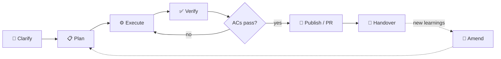

<div align="center">

# 🧱 open-scaffold

**A repo-native operating system for agent-orchestrated development.**

[](LICENSE)
[](https://github.com/jeanclaudevibedan/open-scaffold/generate)
[](#-recommended-runtimes)
[](#-dogfooded)

</div>

> [!TIP]
> **New here?** Skip straight to [🚀 Quickstart](#-quickstart).
> **Want the why?** Start with [💥 The problem](#-the-problem).

---

## 💥 The problem

Semi-autonomous software work is finally possible, but the default shape is chaos:

```text
Discord thread here.
GitHub issue there.
Claude Code in one terminal.
Codex/OMX in another.
A bot says it is done.
A PR appears.
Nobody can reconstruct what was asked, what ran, what passed, or who approved it.
```

The exciting part is not just "an AI coding agent wrote code." The exciting part is a build loop where a human can steer from Discord/chat/voice, a coordinator bot such as Hermes or a claw-code-style agent can package work, OMC/Claude Code and OMX/Codex can execute bounded slices, GitHub PRs and Codex review can gate changes, and the repo remembers the truth after the chat scroll disappears.

**open-scaffold is the chassis and black box recorder for that loop.** It gives semi-autonomous building a durable control substrate: mission, roadmap, task/run identity, executable plans, run packets, evidence, amendments, PR traceability, and verification gates as files that any human, bot, agent, or runtime can read.

Open Scaffold is not the Discord bot, not the agent runtime, and not the PR reviewer. It is the repo-native protocol that lets those pieces cooperate without making chat, terminal state, or a model transcript the source of truth.

A mature Open Scaffold loop looks like:

```text
ROADMAP / idea
  -> GitHub issue or Kanban task_id
  -> .osc plan/spec/package
  -> .osc run_id packet
  -> OMC/Claude Code, OMX/Codex, plain agent, or human execution
  -> Discord/chat/GitHub comments for questions and approvals
  -> branch / PR / CI / Codex review
  -> evidence / release note / next amendment
```

---

## ✨ What you get

| | | |
|---|---|---|
| 🗺️ **Roadmap-first** | `ROADMAP.md` captures the product/system direction before live tasks, issues, or runtime sessions fragment the work. The post-v0.3 roadmap now explicitly tracks independent-review findings: hardening, adapter proof, downstream examples, packaging, and docs compression. | [→](ROADMAP.md) |
| 🎯 **Mission-first** | `MISSION.md` defines goals and non-goals before a single line is written. | [→](MISSION.md) |
| 🔒 **Immutable plans** | Plans in `.osc/plans/` (organized in stage subfolders: `active/`, `backlog/`, `done/`, `blocked/`) follow a 7-section schema and become read-only once committed. No silent scope creep. | [→](.osc/plans/handoff-template.md) |
| 📝 **Amendment protocol** | "I got smarter" moments become `<plan>-amendment-<n>.md` files. Run `./amend.sh <plan-slug>` to autonumber, scaffold, and stamp the changelog in one shot. | [→](.osc/plans/README.md) |
| 🧭 **Design choices** | A short page in `docs/decisions/` explains why the scaffold is the way it is — paired views, immutable plans, adapter-mediated orchestration. | [→](docs/decisions/README.md) |
| ✅ **`verify.sh` / `osc verify`** | Compliance checks in shell or CLI form. Agents run the quick check before touching code. | [→](verify.sh) |
| 🧰 **`osc` CLI** | Runtime-neutral command-line helper. Parses plans, reports status, and writes prompt/artifact bundles under `.osc/runs/` without spawning agents. Run binding options can record task/run/operator/harness metadata. | [→](package.json) |
| 🔌 **Integrations and harnesses** | Open Scaffold supports orchestrators/agents and runtime harnesses without confusing their roles: Hermes/Claw/etc. can operate the scaffold; OMC and OMX are Claude Code/Codex workflow harnesses. | [→](docs/ADAPTERS.md) |
| 🧾 **Task/run model** | `task_id` owns durable work, `run_id` owns one execution attempt, chat threads are operator-surface bindings, and ambiguous packages route to clarification before harness dispatch. | [→](docs/TASK_RUN_MODEL.md) |
| 🧪 **Slice close protocol** | Evidence receipts, postflight decisions, approval strength, correction routing, and next-slice inheritance keep "done" from becoming vibes. | [→](docs/SLICE_CLOSE_PROTOCOL.md) |
| 🛩️ **Glass cockpit protocol** | Runtime-neutral event types for status, blockers, questions, approvals, evidence receipts, PR links, and build-in-public streams without making chat canonical. | [→](docs/GLASS_COCKPIT_PROTOCOL.md) |
| 🔗 **Runtime binding contract** | Binding lifecycle and responsibilities for OMC, OMX, plain-agent, and human lanes that consume `run.json` outside core. | [→](docs/RUNTIME_BINDING_CONTRACT.md) |
| 🚦 **Runtime dispatch pattern** | Coordinators consume `.osc/runs/<run_id>/run.json` and launch OMX/OMC/plain-agent/human lanes while core stays non-spawning. Includes the current Mermaid map. | [→](docs/RUNTIME_HARNESS_DISPATCH.md) |
| 🐙 **GitHub PR loop** | Issues, branches, PR templates, CI, Codex review triggers, and human approvals become the publication/review layer for semi-autonomous work. | [→](docs/GITHUB_WORKFLOW.md) |
| 📦 **Release / evidence notes** | `.osc/releases/` records scaffold-native release evidence when a full GitHub Release is too heavy: issue, plan, run ID, PR, verification, and follow-up. | [→](.osc/releases/README.md) |
| 🛩️ **Glass cockpit** | Discord/Slack/Telegram/GitHub comments can expose nudges, blockers, approvals, and build-in-public reports while the repo/task/GitHub chain stays canonical. | [→](docs/OPEN_SCAFFOLD_SYSTEM.md) |

---

## 🔁 The workflow

Six phases, one per session or feature slice. The amendment loop handles the "I got smarter" case without silent edits.



Each phase maps to a concrete file or command. Full phase-to-tool cheat sheet lives in [docs/WORKFLOW.md](docs/WORKFLOW.md).

---

## 🚀 Quickstart

> [!TIP]
>
> ### 🤖 Let an LLM do it for you
>
> Paste this one-liner into any LLM — coding agent (Claude Code, Cursor, Codex CLI) or chat LLM (ChatGPT, Claude.ai, Gemini web). The agent clones the template, opens [`LLM_QUICKSTART.md`](LLM_QUICKSTART.md) from inside the clone, detects its own capability, and walks you through bootstrap → verify → handoff.
>
> ```text
> Clone https://github.com/jeanclaudevibedan/open-scaffold into a new project directory, then open LLM_QUICKSTART.md from inside the clone and walk me through it.
> ```
>
> **Prefer to drive it yourself?** The manual steps below do the same thing by hand. ⬇️

---

### 1. Create your project from the template

```bash
gh repo create <your-project> --template jeanclaudevibedan/open-scaffold --clone
cd <your-project>
```

Or hit the green **Use this template** button on GitHub.

### 2. Run bootstrap

```bash
./bootstrap.sh
```

Bootstrap asks three questions and writes your answers into `MISSION.md`:

- **What is this project?** — one sentence
- **What should it achieve?** — main outcomes (separate multiple with semicolons)
- **What should this project NOT do?** — adjacent features explicitly out of scope (separate multiple with semicolons)

That's the mission. Everything downstream traces back to it.

### 3. Write your first plan

If your goal is clear, tell your agent:

> *"Write a plan in `.osc/plans/active/` for \<your task\> using the handoff template."*

If your goal is fuzzy, let the agent interview you into clarity first:

```bash
# With OMC / Claude Code:
/deep-interview

# With OMX / Codex:
$deep-interview
```

Without a runtime harness, ask any capable agent: *"Interview me until you understand exactly what to build, then write a plan in `.osc/plans/active/` using `.osc/plans/handoff-template.md`."*

If you deliberately want a runtime-specific harness lane, use that harness against the Open Scaffold plan/spec: OMC for Claude Code workflows (`/deep-interview`, `/ralplan`, `/team`, `/ralph`) or OMX for Codex workflows (`$deep-interview`, `$ralplan`, `$team`, `$ralph`, `$ultrawork`).

**Fully manual fallback:**

```bash
cp .osc/plans/handoff-template.md .osc/plans/active/my-first-task.md
$EDITOR .osc/plans/my-first-task.md
```

Either way you end up with a plan file: Context, Goal, Constraints, Files to touch, Acceptance criteria, Verification steps, Open questions.

### 4. Create a bound run package when a harness should execute it

Open Scaffold core still does not spawn agents, but it can create a canonical run packet that a coordinator or adapter can dispatch into OMC, OMX, a plain agent, or a human lane.

```bash
npm run osc -- run .osc/plans/active/my-first-task.md \
  --task-id TASK-2026-0511-demo \
  --executor omx-codex \
  --harness-skill '$ralplan' \
  --operator-surface discord \
  --repo /path/to/project
```

This writes `.osc/runs/<run_id>/run.json` with task/run bindings, executor choice, operator-surface binding, package-quality checks, prompts, and commit policy. If the package lacks goal, acceptance criteria, verification, or has blocking open questions, dispatch should route to clarification/deep-interview before implementation.

To see how an external binding would consume that packet without launching a runtime, run the dry-run example in [docs/examples/runtime-binding-dry-run.mjs](docs/examples/runtime-binding-dry-run.mjs). It validates a generated `run.json`, prints the intended handoff, and explicitly exits without reading credentials, mutating global config, or spawning Claude, Codex, OMC, OMX, or any other lane.

For the public coordinator-to-harness pattern, including the current Mermaid map of where the system is now, see [docs/RUNTIME_HARNESS_DISPATCH.md](docs/RUNTIME_HARNESS_DISPATCH.md).

### 5. Open a traceable PR when code changes

When a slice changes code or public docs, carry the trace into GitHub:

```text
Issue/task -> plan/spec -> run_id -> branch -> PR -> CI + Codex review + human approval -> merge
```

The template includes `.github/pull_request_template.md` and `.github/ISSUE_TEMPLATE/feature.yml`. If the Codex connector is enabled for the repo, trigger review by opening the PR for review, marking a draft ready, or commenting `@codex review`. See [docs/GITHUB_WORKFLOW.md](docs/GITHUB_WORKFLOW.md).

### 6. Check compliance (optional but satisfying)

```bash
./verify.sh
```

Exit code 0 means your mission is defined, a plan exists, amendments are sequential, and the methodology is intact. Pair it with `--strict` once you have plans shipping.

---

## 🧩 Scaffold vs. runtime vs. cockpit

> A runtime without a scaffold is a powerful engine with no chassis. A cockpit without truth is just a pretty dashboard.

| | **Open Scaffold core** | **Coordinator/task state** | **Runtime harness** | **Glass cockpit / transport** |
|---|---|---|---|---|
| **Defines** | How the project remembers intent, work, evidence, and gates | What should happen next and what state work is in | How a specific base agent plans/executes/verifies | How humans see, steer, approve, or unblock work |
| **Examples** | `MISSION.md`, `ROADMAP.md`, `.osc/plans/`, `.osc/runs/`, docs, evidence | Hermes Kanban/Nudge, GitHub Issues, Linear/Jira, custom bots; owns `task_id` | OMC for Claude Code, OMX for Codex, or future harnesses; binds to `run_id` | Discord, Slack, Telegram, GitHub comments, CLI dashboard, clawhip-style event routing; binds via thread/comment ids |
| **Persists** | Across every session, agent, and tool | Until task/issue lifecycle closes | Per runtime/session unless promoted | Per message/thread/event unless linked back to truth |
| **Required?** | Yes — this is the floor | Needed for multi-step/live work | No — harnesses amplify it | No — cockpits make it visible |

Open Scaffold is the chassis and logbook. Coordinators such as Hermes decide what should happen next and may maintain live task/package state. OMC and OMX are execution/orchestration lanes for Claude Code and Codex respectively. clawhip-style tools are event/status transport. Discord-style build-in-public rooms are glass cockpits: useful surfaces, not canonical truth. The task/run split is explicit: `task_id` tracks durable work, `run_id` tracks one attempt, `question_id` tracks human blockers, and chat/thread ids are optional bindings.

---

## 🎚️ Works at every tier

The scaffold runs the same way whether you're on the latest orchestration stack or typing everything yourself. What changes is how much work you do by hand.

| Tier | What happens | Delegation |
|---|---|---|
| 🧭 **Orchestrator-led** (Hermes, Claw/OpenClaw, custom bot) | Orchestrator reads roadmap/plans, creates tasks/issues, invokes runtimes, and records evidence | Full system loop if the orchestrator supports it |
| 🤖 **Claude Code + OMC harness** | Claude Code uses OMC workflow modes against bounded Open Scaffold work | `/team`, `/ultrawork`, `/ralph`, `/ralplan` |
| ⚡ **Codex + OMX harness** | Codex uses OMX workflow modes against bounded Open Scaffold work | `$team`, `$ralph`, `$ultrawork`, `$deep-interview`, `$ralplan` |
| 🧠 **Plain Claude Code / Cursor / Codex / Gemini** | Agent reads plans when told to via `CLAUDE.md` / `AGENTS.md` | Agent describes parallelism; you dispatch |
| ⌨️ **Local LLM or no agent at all** | You read the plans. The methodology still works. | Run `./delegate.sh <plan>` for copy-pasteable prompts |

Higher tiers automate more. Lower tiers keep every file and protocol intact.

---

## 🛠️ Runtime and cockpit choices

Open Scaffold does not require one preferred runtime. Bring the orchestrator, harness, and operator surface that fit your context:

- **Coordinators/task state:** Hermes + Kanban/Nudge, GitHub Issues, Linear/Jira, or custom bots for deciding next steps and tracking live state.
- **Claude Code lane:** OMC / oh-my-claudecode for `/deep-interview`, `/ralplan`, `/team`, `/ralph`, `/ultrawork`, hooks, skills, and team workflows.
- **Codex lane:** OMX / oh-my-codex for `$deep-interview`, `$ralplan`, `$team`, `$ralph`, `$ultrawork`, `$ultragoal`, and Codex-specific execution modes.
- **Glass cockpits / transport:** Discord, Slack, Telegram, CLI dashboards, GitHub comments, webhook/gateway glue, or clawhip-style routing for nudges, blockers, approvals, session events, and build-in-public reports.

Neither OMC nor OMX is required. Use Cursor, Windsurf, Aider, or a plain terminal — the scaffold is still markdown, scripts, and source-of-truth boundaries.

---

## 🤔 Questions you're probably asking

Not an FAQ. These are the questions that matter most. For the full list, see [docs/FAQ.md](docs/FAQ.md).

<details>
<summary><b>So, does this allow multi-agent automatic orchestration?</b></summary>

> Not by itself. Open Scaffold is the source-of-truth contract; orchestration is a coordinator or runtime-lane job. What it *does* is give systems a durable structure to act on: Hermes can maintain Kanban/package state and choose a lane; OMC can run Claude Code workflows such as `/team` or `/ultrawork`; OMX can run Codex workflows such as `$team`, `$ralph`, or `$ultrawork`; clawhip-style tooling can route session/status events. OMX is not automatic — it is selected when the coordinator dispatches a bounded package into Codex/OMX. Without a runtime, `./delegate.sh <plan>` emits terminal prompts you paste into separate sessions.

</details>

<details>
<summary><b>Does this make my agent smarter, or just more disciplined?</b></summary>

> Disciplined. Smarter is the model's job. What changes is that your agent stops forgetting, stops drifting, and stops making the same class of mistake twice — because the constraints are written down where it can re-read them next session.

</details>

<details>
<summary><b>What's the difference between this and any other framework out there?</b></summary>

> Most "AI dev frameworks" are orchestration runtimes — they're engines. This is the chassis. It treats the problem as **persistence of intent across sessions**, not automation of a single session. The [amendment protocol](.osc/plans/README.md), the immutability rule, the [paired CLAUDE.md/AGENTS.md views](docs/decisions/README.md) — boring methodology pieces nobody else ships because they're not glamorous. They're also the ones that actually matter six weeks in.

</details>

<details>
<summary><b>Why can't I just edit the plan when something changes?</b></summary>

> Because edits silently rewrite history. The amendment protocol is the trade: run `./amend.sh <plan-slug>` — it drops a fresh `<plan>-amendment-<n>.md` next to the plan, scaffolds the 5-section schema, and stamps MISSION.md's changelog. The original plan stays frozen. Slower in the moment, honest forever after. ([How amendments work](.osc/plans/README.md))

</details>

<details>
<summary><b>Do I need Claude Code, OMC, or OMX to use this?</b></summary>

> No. The core layer is markdown files and bash scripts. It works with any agent, any editor, or a human typing by hand. OMC and OMX are force-multipliers, not prerequisites.

</details>

<details>
<summary><b>Does this work with Cursor / Codex / Aider / local LLMs?</b></summary>

> Yes to all. Cursor and Aider read [CLAUDE.md](CLAUDE.md) naturally. Codex reads [AGENTS.md](AGENTS.md). Local LLMs usually need you to paste context manually, but the methodology doesn't care — the plan files are for *you* as much as for the agent.

</details>

<details>
<summary><b>Isn't this over-engineering for a solo side project?</b></summary>

> If your side project dies in one session, yes. If it survives to session ten and you've forgotten half the decisions from session two — which is what usually happens — then no, it's the cheapest possible fix. The whole scaffold is 11 files. You can follow it by hand in 15 minutes a week.

</details>

<details>
<summary><b>When does this actively <i>not</i> help?</b></summary>

> Single-session throwaway scripts. One-off bug fixes. Prototypes you'll delete in an hour. Anything where the "drift across sessions" pain doesn't exist. Using open-scaffold for those is like writing a PRD for a grocery list.

</details>

---

## 📁 What's inside

<details>
<summary><b>File map</b></summary>

| File | Purpose |
|---|---|
| [`MISSION.md`](MISSION.md) | Source of truth for what the project is: mission, goals, non-goals, changelog. |
| [`ROADMAP.md`](ROADMAP.md) | Product/system milestones and self-dogfood chain. |
| [`docs/OPEN_SCAFFOLD_SYSTEM.md`](docs/OPEN_SCAFFOLD_SYSTEM.md) | Ontology: core, orchestrators, runtime harnesses, task bridges, glass cockpits, GitHub. |
| [`docs/TASK_RUN_MODEL.md`](docs/TASK_RUN_MODEL.md) | Canonical `task_id` / `run_id` / `question_id` model and chat/operator binding rules. |
| [`docs/GITHUB_WORKFLOW.md`](docs/GITHUB_WORKFLOW.md) | GitHub issue → run packet → PR → CI/Codex/human review loop. |
| [`CLAUDE.md`](CLAUDE.md) | Claude Code's entry point. Agents read this first. |
| [`AGENTS.md`](AGENTS.md) | Entry point for Codex, Gemini, and other agents (paired view of `CLAUDE.md`). |
| [`.osc/plans/handoff-template.md`](.osc/plans/handoff-template.md) | The 7-section schema every plan file follows. |
| [`.osc/plans/README.md`](.osc/plans/README.md) | Amendment protocol in under 200 words. |
| [`docs/decisions/`](docs/decisions/) | ADR index, template, and two ships-as-examples. |
| [`docs/WORKFLOW.md`](docs/WORKFLOW.md) | Phase-to-tool cheat sheet. Clarify → Plan → Execute → Verify → Amend. |
| [`bootstrap.sh`](bootstrap.sh) | Day-one interactive setup. Idempotent. |
| [`verify.sh`](verify.sh) | Compliance checker. `--quick`, `--standard`, `--strict`. |
| [`delegate.sh`](delegate.sh) | Parallel-group prompt generator for non-agent users. |
| [`amend.sh`](amend.sh) | Amendment scaffolder. Autonumbers the next amendment, scaffolds the 5-section schema, and stamps MISSION.md's changelog. |
| [`close.sh`](close.sh) | Plan closer. Moves a completed plan and its amendments to `done/` and stamps MISSION.md's changelog. |
| [`.osc/RULES.md`](.osc/RULES.md) | Compact non-negotiable principles. Re-read before any major action on project structure. |
| [`.osc/plans/WORKFLOW.md`](.osc/plans/WORKFLOW.md) | Stage-based plan workflow rules. Defines how plans move between `active/`, `backlog/`, `done/`, and `blocked/`. |

</details>

<details>
<summary><b>Glossary</b></summary>

**AC (Acceptance Criterion)** — A testable yes/no statement that defines "done." Every plan file has them. If they pass, the work is done. If they don't, it isn't.

**ADR (Architecture Decision Record)** — A short note explaining *why* a decision was made, not just *what*. Lives in `docs/decisions/`. Future-you (and future-agents) will thank present-you.

**Amendment Protocol** — The rule that plan files are immutable once committed. New learnings become `<slug>-amendment-<n>.md` files (in the same stage folder as the parent plan — `active/`, `backlog/`, `done/`, or `blocked/`) instead of silent edits. Scaffolded by `./amend.sh <plan-slug>`. Full rules in [`.osc/plans/README.md`](.osc/plans/README.md).

**Amend** — `./amend.sh <plan-slug>`. Autonumbers the next amendment file, scaffolds the 5-section schema, and stamps MISSION.md's changelog. Use `--backlog` to place the amendment in `backlog/` instead of `active/`. Use this instead of hand-writing amendment files.

**Close** — `./close.sh <plan-slug>`. Moves a completed plan and its amendments from their current stage folder to `done/` and stamps MISSION.md's changelog. Use this when all acceptance criteria pass.

**Bootstrap** — `./bootstrap.sh`. Interactive, idempotent, optional. Walks you through defining your mission on day one.

**Delegate** — `./delegate.sh <plan>`. Reads a plan's Execution Strategy section and prints prompts you can paste into parallel terminal sessions. Designed for users without an orchestration runtime.

**OMC / OMX** — Runtime harnesses, not universal orchestrators: [oh-my-claudecode](https://github.com/yeachan-heo/oh-my-claudecode) extends Claude Code workflows; [oh-my-codex](https://github.com/Yeachan-Heo/oh-my-codex) extends Codex workflows. Recommended when useful, never required.

**Task / Run / Question** — `task_id` is durable work identity, `run_id` is one execution attempt, and `question_id` is one blocking clarification/approval inside a run. Chat thread/message ids are bindings, not canonical truth.

**Slice Close** — The evidence-backed decision that a feature slice is approved, weak-approved, rejected, blocked, closed, or carried into a next slice. It records acceptance-gate status, verification evidence, known gaps, approval strength, and correction routing. See [`docs/SLICE_CLOSE_PROTOCOL.md`](docs/SLICE_CLOSE_PROTOCOL.md).

**Glass Cockpit** — A visible operator surface such as Discord, Slack, Telegram, GitHub comments, CLI dashboard, or web UI. Cockpits show status, blockers, questions, approvals, evidence receipts, and public progress, but source-of-truth IDs and evidence live in the repo/task/run/PR chain. See [`docs/GLASS_COCKPIT_PROTOCOL.md`](docs/GLASS_COCKPIT_PROTOCOL.md).

**Runtime Binding** — The glue that consumes `.osc/runs/<run_id>/run.json`, validates package quality, launches or hands off to a selected OMC/OMX/plain-agent/human lane outside core, attaches runtime metadata, and returns evidence. See [`docs/RUNTIME_BINDING_CONTRACT.md`](docs/RUNTIME_BINDING_CONTRACT.md).

**Plan Immutability** — Once a plan is committed to git, it is never edited. Changes layer on top as amendments. This is the single rule that prevents silent scope creep.

**Scaffold** — The project-specific structure that organizes plans, decisions, amendments, and handovers in your repo. open-scaffold is a scaffold. OMC and OMX are runtimes.

**Session Handover** — The practice of producing explicit, reviewable deliverables at the end of each work session so the next session (human or agent) starts with context, not questions. See [`docs/WORKFLOW.md`](docs/WORKFLOW.md).

**verify.sh** — The built-in zero-dependency compliance checker. `--quick` (what agents run automatically), `--standard` (the default), `--strict` (full methodology audit).

**Shell scripts vs `osc`** — Shell scripts are the day-zero compatibility floor: useful before `npm install`, global CLI setup, or any agent runtime. The tested `osc` CLI is the canonical implementation path for richer run/package behavior; shell helpers should remain thin wrappers or fallbacks over time.

</details>

<details>
<summary><b>Under the hood</b></summary>

open-scaffold has several cooperating layers:

- **Core methodology** — mission, roadmap, folder discipline, immutable plans, amendment protocol, evidence/run packets, ADRs, session handover, and the `osc` prompt/artifact CLI. Framework-agnostic.
- **Coordinators/task state** — Hermes, GitHub Issues, Linear/Jira, or custom systems choose what should happen next and track live work through durable task IDs.
- **Runtime lanes** — OMC for Claude Code and OMX for Codex. They amplify execution through bound run IDs but do not own the source of truth.
- **Event transport** — clawhip-style tools, webhooks, and gateways route session/status events into operator surfaces.
- **GitHub review layer** — issues, branches, PRs, CI, Codex review, and human approvals gate publication.
- **Slice close / evidence loop** — evidence receipts, postflight decisions, approval strength, correction routing, and next-slice inheritance prevent weak or missing proof from becoming durable product truth.
- **Glass cockpits** — Discord/Slack/Telegram/GitHub comments/CLI dashboards expose status, blockers, questions, approvals, evidence receipts, PR links, and build-in-public streams through replaceable event surfaces.

The scaffold is the load-bearing part. Agents and runtimes amplify it. Cockpits make it visible. You can strip the runtimes away and the methodology still holds.

</details>

---

## 🐕 Dogfooded

open-scaffold was built using open-scaffold.

---

## 📜 License

[MIT](LICENSE). Fork it, ship it, rip it apart. Just don't forget to define your mission first.
