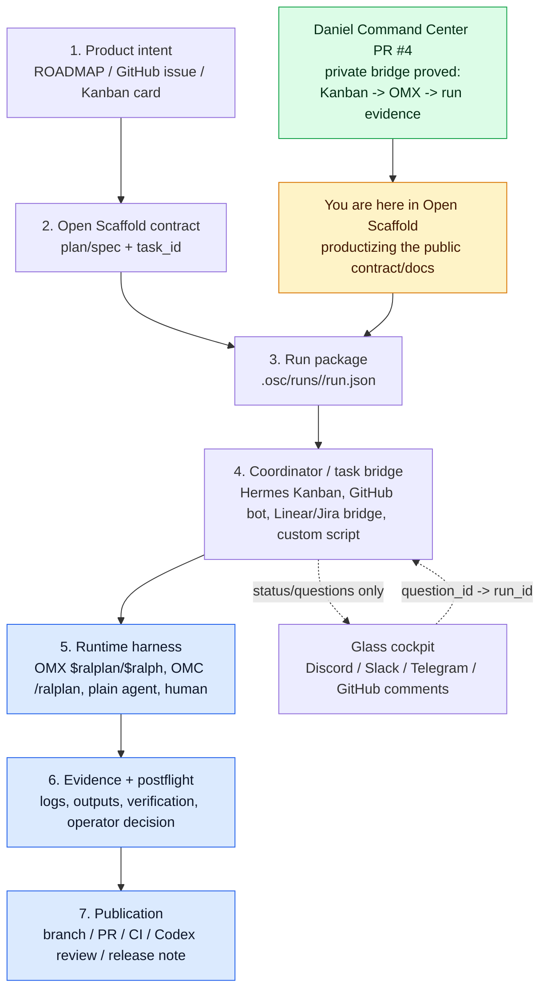

# Runtime Harness Dispatch Pattern

Open Scaffold core defines the portable contract for semi-autonomous work. It does **not** own the local control plane that launches agents. A coordinator or runtime-specific binding consumes `.osc/runs/<run_id>/run.json` and dispatches the selected harness.

This page captures the pattern proven in Daniel's private Command Center with Hermes Kanban -> OMX `$ralplan`, then translates it into the public Open Scaffold model. The detailed adapter/binding responsibilities live in [`docs/RUNTIME_BINDING_CONTRACT.md`](RUNTIME_BINDING_CONTRACT.md).

## Executive rule

```text
Open Scaffold packages.
A task bridge coordinates.
A harness executes.
An operator surface observes.
GitHub publishes.
Evidence proves.
```

## Where we are right now



Current state:

- The **private Command Center bridge** has been proven with Hermes Kanban dispatching a task into detached OMX `$ralplan` and preserving run evidence.
- Open Scaffold already has the generic `task_id` / `run_id` / `operator_surface` schema.
- This Open Scaffold slice documents the bridge as a public, runtime-neutral dispatch pattern.
- The next adapter/product step is an OMX/OMC binding that consumes `.osc/runs/<run_id>/run.json` and performs real launch/postflight outside core. The v1 public contract for this is [`docs/RUNTIME_BINDING_CONTRACT.md`](RUNTIME_BINDING_CONTRACT.md).

## Layer ownership

| Layer | Owns | Examples | Must not own |
|---|---|---|---|
| Open Scaffold core | repo-native contract, run packet, evidence locations, task/run identity | `.osc/plans`, `.osc/runs`, `osc run`, docs, PR templates | live task lifecycle, runtime auth, agent spawning |
| Task bridge / coordinator | operational state and dispatch decision | Hermes Kanban, GitHub Issues bot, Linear/Jira bridge, local queue | final evidence or runtime internals |
| Runtime harness | actual planning/build/review loop while alive | OMX, OMC, Claude Code, Codex CLI, human lane | canonical task database or commit authority |
| Operator surface | visibility, questions, approvals | Discord, Slack, Telegram, GitHub comments, CLI dashboard | source of truth |
| GitHub/publication | versioned implementation and review | branch, PR, CI, Codex connector review, release | runtime session truth |

## Canonical public flow

```text
ROADMAP item / issue / task
  -> plan or spec in .osc/plans or .osc/specs
  -> osc run ... --task-id ... --executor ... --harness-skill ...
  -> .osc/runs/<run_id>/run.json
  -> coordinator/adapter validates packageQuality.executable
  -> selected harness executes in isolated session/worktree
  -> artifacts/logs/outputs promoted back to .osc/runs and/or PR
  -> postflight verifies against acceptance criteria
  -> operator approval gates merge/release
```

## What Open Scaffold core should generate

Open Scaffold core should generate or preserve enough information for a launcher to act without guessing:

```json
{
  "taskId": "issue:42",
  "runId": "20260512T090000Z-m5-runtime-harness-bindings",
  "executor": {
    "lane": "omx-codex",
    "harnessSkill": "$ralplan",
    "spawning": false
  },
  "runtime": {
    "repoPath": "/absolute/path/to/repo",
    "worktreePath": null,
    "branch": "feat/runtime-harness-bindings"
  },
  "bindings": {
    "operatorSurface": "discord",
    "operatorThreadId": null,
    "githubIssue": "42",
    "githubPr": null
  },
  "packageQuality": {
    "executable": true,
    "blockers": [],
    "requiredAction": null
  },
  "commitPolicy": "no commit/push unless explicitly approved by the operator"
}
```

`spawning: false` is deliberate. Core writes the black-box recorder package; a coordinator or adapter launches the harness.

## What the coordinator/adapter should do

A coordinator or runtime-specific binding should follow the contract in [`docs/RUNTIME_BINDING_CONTRACT.md`](RUNTIME_BINDING_CONTRACT.md):

1. Read `.osc/runs/<run_id>/run.json`.
2. Refuse dispatch unless `packageQuality.executable` is true.
3. Validate executor lane and harness skill.
4. Create an isolated runtime session or worktree when needed.
5. Launch the selected harness with the generated prompt/artifact bundle.
6. Attach runtime bindings back to the run record:
   - tmux session
   - process id
   - worktree
   - branch
   - log paths
   - operator thread/comment id
7. Route blocking questions by `question_id -> run_id`, never by latest chat message.
8. Promote final artifacts, status, logs, and verification evidence back into `.osc/runs`, GitHub PRs, or release notes.
9. Leave commit/push/merge gated by the operator unless the package explicitly grants that authority.

## OMX example

A coordinator can turn this Open Scaffold command:

```bash
npm run osc -- run .osc/plans/active/001-runtime-harness-bindings.md \
  --task-id issue:42 \
  --executor omx-codex \
  --harness-skill '$ralplan' \
  --operator-surface discord \
  --repo /path/to/repo
```

into a bounded OMX launch such as:

```text
$ralplan "Read .osc/runs/<run_id>/package.md. Plan only. Do not implement, commit, push, deploy, or publish. If blocked, emit BLOCKED with a question_id. If ready, emit READY_FOR_POSTFLIGHT and cite evidence paths."
```

The exact launch mechanics — tmux, Codex auth, update prompts, hooks, watchdogs, and runtime logs — belong in an OMX binding or coordinator, not Open Scaffold core.

## Anti-patterns

Avoid:

- putting Hermes Kanban, Discord bot state, or Daniel-specific auth setup inside Open Scaffold core;
- making Discord the task database;
- letting OMX/OMC runtime state replace `.osc/runs` evidence;
- dispatching a harness from vague prose without a run packet;
- letting a chat reply answer a question without `question_id -> run_id` correlation;
- treating `spawning: false` as a limitation instead of the core boundary.

## Product implication

Open Scaffold should productize the method, not Daniel's private cockpit. The public core should make every task/run/harness boundary clear enough that many coordinators can implement the launch layer:

```text
Open Scaffold core = WHAT/WHERE/PROOF
Coordinator/adapter = WHEN/WHO/LAUNCH
Harness = HOW TO EXECUTE
Operator surface = HUMAN CONTROL GLASS
GitHub = PUBLIC VERSIONED REVIEW
```
