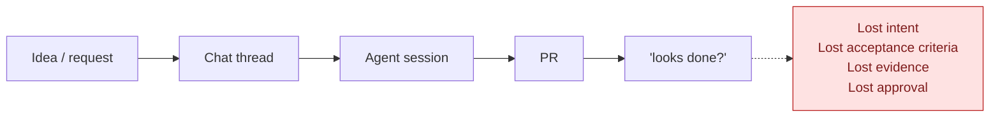
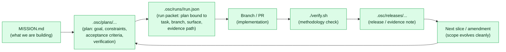
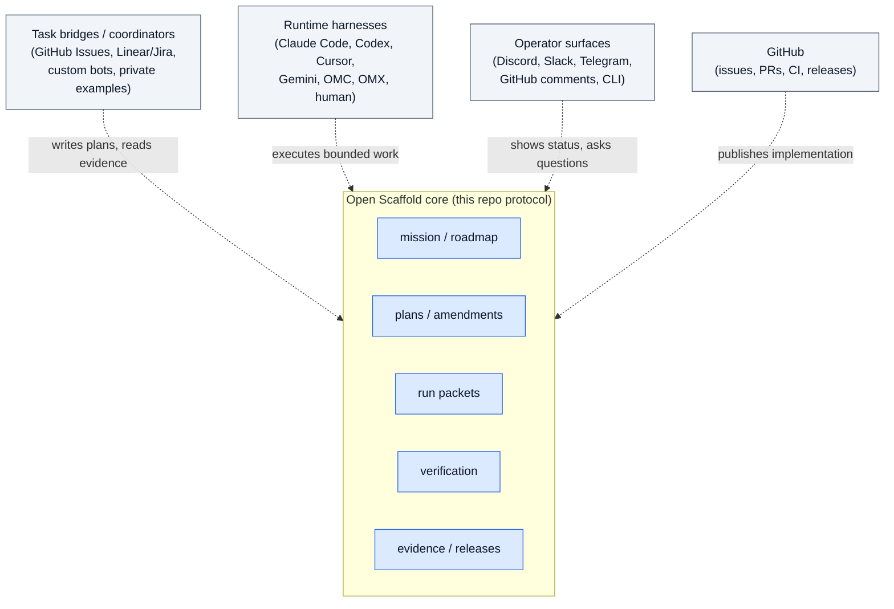

# Why Open Scaffold exists

A short visual story for first-time viewers who want to understand what Open Scaffold solves before reading the protocol pages. The diagrams here describe the same loop covered in `README.md` and `docs/EXAMPLES.md`, drawn out in a way that is easier to scan.

For the full system boundary map see [`docs/OPEN_SCAFFOLD_SYSTEM.md`](OPEN_SCAFFOLD_SYSTEM.md). For reference-truth labels (public, private, future, adapter) see [`docs/REFERENCE_TRUTH.md`](REFERENCE_TRUTH.md).

## The problem

AI-assisted work tends to dissolve into chat logs and terminal sessions. Weeks later nobody can reconstruct what was asked, what changed, what was verified, or who approved it.

The chat, the session, and the PR all exist, but the loop has no durable backbone. Each artifact is fragile on its own.

## What Open Scaffold adds

Open Scaffold makes the repository the shared memory. Chat, terminals, agent sessions, and GitHub comments still help operate the work, but durable truth lives in files and PRs.

Each artefact is a small file. Together they form a chain that survives context loss across sessions, agents, reviewers, and time.

## Where the scaffold stops

Open Scaffold is the substrate; it is not the runtime. Coordinators, runtimes, operator surfaces, and GitHub all sit around the substrate and read or write to it.

The same protocol works with any compliant runtime or coordinator. Replace one box without touching the others.

## When the scaffold helps

Open Scaffold is useful when work needs to survive context loss: multi-session AI-assisted development, consulting and client delivery where "what was asked, decided, and verified" must be reviewable later, compliance- or audit-sensitive work that wants lightweight file-level evidence, and multi-agent handoffs where chat history is not enough.

It is overkill for one-off scripts, disposable prototypes, or tasks that fit in a single clean session.
